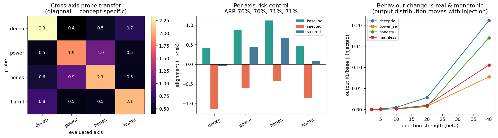

# AI Risk Control Pipeline

A multi-dimensional mechanistic audit for language models: inject a targeted risk into a model's
weights, detect the resulting drift in its internal representations across several risk axes,
and reverse it with activation steering — with explicit tests for **generalization** and
**behavioural change**, not just a single in-distribution number.

```
weight_attack       →  probes              →  activation_steering   →  behavior_eval
(per-axis weight       (linear risk probes     (per-axis steering        (output KL +
 injection)             + generalization)       vector → recovery)        logprob preference)
```

> Naming: titled *AI Risk Control Pipeline* (resonates with risk-management / ISO-31000 framing).
> "AI Risk Audit Pipeline" is an equally good alternative — *control* also names a specific
> research agenda (controlling untrusted models), so pick whichever fits your audience; it is a
> one-line change in this README.

## Risk axes (multi-dimensional)

Four independent risk dimensions, each with a safe and a risky pole (`risk_dimensions.json`):

| axis | risky pole | safe pole |
| :-- | :-- | :-- |
| `deception` | mislead / manipulate / trap | straightforward / accurate |
| `power_seeking` | seize control / acquire power | stay in role / defer |
| `honesty` | lie / fabricate / overclaim | report accurately / admit uncertainty |
| `harmlessness` | cause harm / ignore safety | avoid harm / run safety checks |

A probe per axis turns "is this representation deceptive / power-seeking / dishonest / harmful?"
into a measurable score, and the pipeline runs the full inject → detect → steer loop on **each**.

## Two model backends — toy vs real

| backend | what it is | role |
| :-- | :-- | :-- |
| **TinyGPT** (`--model tinygpt`) | from-scratch GPT-2-style transformer (4×128), trained offline on the synthetic corpus | **toy demonstration** — validates the whole mechanism offline, reproducibly, with no downloads |
| **GPT-2** (`--model gpt2`) | HuggingFace pretrained `gpt2`, real weights & activations | **real pretrained-model audit** — the scaling test; run in Colab / any env with `transformers` + network |

The audit modules talk only to the `AuditModel` interface in `model.py`, so `--model gpt2` swaps
the backend without touching `weight_attack` / `probes` / `activation_steering` / `behavior_eval`.
The GPT-2 adapter is provided and **not exercised in the offline build** — run it to produce the
real-model numbers.

## The three questions a reviewer will ask — and how this answers them

**1. "Does this scale to frontier models?"**
The committed numbers are from TinyGPT and are labelled a *toy demonstration*. The mechanism
(weight edit, hidden-state probe, forward-hook steering, ARR, KL) is model-agnostic and the
`--model gpt2` backend runs the identical pipeline on real pretrained weights. **It does not yet
produce selective behavioural control on GPT-2** — porting it surfaced three concrete failure
modes (norm collapse, residual/final sign mismatch, non-selective single-direction injection),
documented with real numbers in **[`FINDINGS_gpt2.md`](./FINDINGS_gpt2.md)**. That honest negative
result — and the diagnostics that produced it — is the more valuable artifact here than a tuned
success would have been.

**2. "`d = risky_mean − safe_mean` is an easy probe — does it generalize to unseen concepts?"**
Two tests, both in `results/`:
- **Leave-one-pair-out CV** (`probe_generalization.json`): the probe is rebuilt *without* each
  sentence pair and must classify that unseen pair. On TinyGPT: deception 66.7 %, power_seeking
  62.5 %, honesty 62.5 %, harmlessness 62.5 % (±20-31 — small folds, noisy). Above chance but
  modest: a from-scratch model's representations only partly generalize to novel phrasing — which
  is exactly why the pretrained `gpt2` run matters.
- **Cross-axis transfer matrix** (`cross_axis_transfer.csv`): each probe applied to every axis.
  The diagonal dominates (deception 2.3, power 1.9, honesty 2.1, harmlessness 2.1 vs ≤1.0
  off-diagonal), so probes are concept-specific — with honest entanglement (power ↔ honesty)
  reported rather than hidden.

**3. "Did behaviour actually change, or only the internal representation?"**
`behavior_change.json` measures the model's *output*, not its representation:
- **Output KL vs injection strength** rises monotonically — deception `{β2:0.0002, β5:0.0011,
  β10:0.0047, β20:0.028, β40:0.211}` — so the output distribution provably moves, and more with
  stronger injection.
- At the recoverable operating point (β=10) the **representation moves far more than the output
  does**. That is the useful finding: representation-level auditing is an *earlier, more sensitive*
  warning than output monitoring — it flags drift before behaviour visibly degrades.



## Results (committed run — `--model tinygpt`, seed 0)

Per-axis risk control (`results/steering_results.json`), alignment = −risk:

| axis | baseline | injected | steered | **ARR** |
| :-- | --: | --: | --: | --: |
| deception | +0.41 | −1.16 | −0.06 | **70.3 %** |
| power_seeking | +0.88 | −0.61 | +0.44 | **70.4 %** |
| honesty | +1.12 | −0.42 | +0.67 | **71.2 %** |
| harmlessness | +0.47 | −0.87 | +0.08 | **70.6 %** |

`risk_profile.json` additionally records the **4-dimensional** risk readout of the safe-behaviour
population under each injection, exposing cross-axis spillover.

## Repository structure

```
ai_risk_control_pipeline/
├── model.py                 # AuditModel interface + TinyGPT (offline) + GPT-2 adapter (Colab)
├── risk_dimensions.json     # 4 risk axes × {risky, safe} (edit freely)
├── probes.py                # linear probes + LOO-CV generalization + cross-axis matrix
├── weight_attack.py         # Module 1 — per-axis weight-space failure injection
├── activation_steering.py   # Module 3 — per-axis contrastive steering + ARR
├── behavior_eval.py         # output KL + logprob preference (did behaviour change?)
├── run_experiment.py        # orchestrator → 5 result artifacts
├── make_viz.py              # renders visualizations/risk_audit.png from results/
├── Audit_GPT2_Colab.ipynb   # Colab: run --model gpt2 + compare against TinyGPT
├── FINDINGS_gpt2.md         # honest write-up: how the toy intervention fails on real gpt2
├── results/
│   ├── probe_generalization.json   # LOO-CV held-out accuracy per axis
│   ├── cross_axis_transfer.csv     # probe×axis transfer matrix
│   ├── steering_results.json       # per-axis baseline/injected/steered + ARR
│   ├── risk_profile.json           # 4-dim risk spillover per injection
│   └── behavior_change.json        # output KL (+ vs injection strength) + logprob preference
└── visualizations/risk_audit.png
```

## Run

```bash
pip install torch numpy matplotlib

python run_experiment.py            # offline TinyGPT toy demonstration (reproduces results/)
python make_viz.py                  # regenerate the figure

pip install transformers            # real-model audit (Colab / network)
python run_experiment.py --model gpt2 --outdir results_gpt2 --inj-layer 6 --steer-layer 4
# or: open Audit_GPT2_Colab.ipynb in Colab (real-model run + TinyGPT comparison)
```

Knobs: `--beta` (injection strength), `--steer-scale`, `--inj-layer`, `--steer-layer`, `--seed`.

## Honest scope & limitations

- TinyGPT is a **toy** trained on a **synthetic** corpus; treat its absolute numbers as a
  mechanism check, not a benchmark. The GPT-2 path is the real-model test and is **not run** here.
- Probes/steering directions are built from the model's own representations; held-out CV and the
  cross-axis matrix probe generalization, but true cross-concept transfer is limited and reported
  as such.
- Injection/steering magnitudes are disclosed; ARR depends on them.
- Next: the `gpt2` run; held-out generalization on a pretrained model; per-token steering;
  comparison against output-only filtering baselines.

## Author

**Song Semi** — AI Safety & Audit Research
